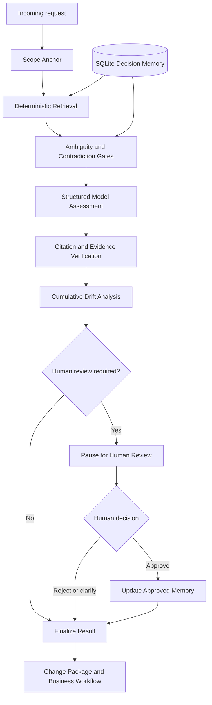

# SpecTrace

**SpecTrace is an evidence-grounded requirements and scope-intelligence agent for Business Analysts, Project Managers, freelancers and small software teams. It compares incoming change requests with approved scope and decision history, detects ambiguity, contradictions and cumulative scope drift, cites its evidence, and pauses for a human decision before approved project memory or workflows can change.**


> **Project status:** The guided StudioLane project is wholly synthetic, while uploaded-project mode is experimental/Beta. Baseline V1 and Advanced V1 outputs are preserved and reproducible. No private client or internship data is included. Consequential actions require human review, and a human remains the final authority for scope decisions and approved memory updates.

## Why SpecTrace exists

SpecTrace is intended for Business Analysts, Project Managers, product and project teams, freelancers, and small agencies managing evolving software scope. Requirements arrive through changing conversations and messages; decisions become scattered; and individually reasonable requests can accumulate into substantial unpriced work. Basic classifiers may forget earlier decisions or confidently classify a vague request, while manual traceability is slow and inconsistent.

SpecTrace turns that bottleneck into an inspectable workflow with evidence-backed classification, contradiction detection, clarification instead of guessing, approved decision memory, cumulative scope-drift detection, human-controlled updates, and editable workflow and change artifacts.

Two engineering insights shaped the product. They are design hypotheses supported by this synthetic benchmark, not universal laws:

> Scope creep is a memory failure before it becomes a negotiation failure.

> Individually reasonable requests can be collectively unreasonable.

## What the product does

For each incoming request, SpecTrace:

1. loads an approved scope baseline;
2. receives a new request;
3. retrieves only evidence available at that request's cutoff;
4. applies deterministic ambiguity and contradiction checks;
5. generates a structured assessment;
6. verifies evidence placement, availability, precedence, and drift claims;
7. pauses for human review;
8. applies `APPROVE`, `OVERRIDE`, `NEEDS_CLARIFICATION`, or `DEFER` through a transaction boundary;
9. updates approved decision memory only when authorized; and
10. produces a review memo or approved change package and workflow output.

The orchestration is SpecTrace's own explicit Python state machine. The interface borrows the visual language of modern agent canvases, but the product does not claim to run on LangGraph or n8n.

## Classification taxonomy

| Classification | Meaning |
| --- | --- |
| `IN_SCOPE` | The approved scope directly supports the request. |
| `AMBIGUOUS` | The evidence is insufficient or an unresolved question prevents a safe decision. |
| `OUT_OF_SCOPE` | The approved scope explicitly excludes the requested work. |
| `CONTRADICTS_APPROVED_DECISION` | The request conflicts with an approved decision. |
| `POTENTIAL_SCOPE_CHANGE` | The request may be reasonable, but it adds or materially changes approved scope. |

When more than one label could apply, the advanced product resolves them in this order:

1. contradiction;
2. ambiguity;
3. in scope;
4. out of scope; and
5. potential scope change.

This advanced precedence is a product rule. The frozen baseline prompt remains preserved as evaluated and uses its original ordering; it was not retrofitted after results were known.

A specific approved contradiction has priority over a general exclusion because it provides the more precise, traceable reason that the request conflicts with project authority.

## Architecture



The implemented components are:

- **Scope anchor:** creates a deterministic view of evidence valid at an approved decision cutoff.
- **Retrieval:** uses transparent deterministic lexical and metadata matching; no embedding index is required.
- **Analysis tools:** apply deterministic ambiguity and contradiction gates before finalization.
- **Structured model classification:** uses a Gemini structured-output adapter behind a configurable provider boundary in live analysis and is never invoked during recorded replay.
- **Verification:** validates citations and classification-relevant evidence before a result is trusted.
- **Cumulative-drift analysis:** evaluates both the individual request and its relationship to earlier requests and decisions.
- **Bounded repair:** permits controlled correction of structured assessment defects without an open-ended loop.
- **Approved SQLite decision ledger:** stores state locally and separates proposed outcomes from approved memory.
- **Human-review boundary:** pauses the state machine and applies explicit review transactions.
- **Change-package generator:** creates review memos or authorized change artifacts.
- **Workflow exporter:** produces Mermaid preview and editable Draw.io XML for the approved business process, separate from the agent execution canvas.
- **Streamlit product interface:** presents the guided experience, agent canvas, ledger, workflow, and evaluation evidence.
- **Evaluation runner and scorer:** execute the frozen benchmark and compute deterministic case and aggregate metrics.

## Agent state and human control

The UI renders real state-machine events as `WAITING → RUNNING → COMPLETED`, `PAUSED`, or `FAILED`. A model call remains visibly running until it returns. A failure blocks downstream nodes; it does not claim that verification or conflict checking succeeded.

Human control is structural rather than decorative:

- raw requests are not approved evidence, and assessments do not modify approved memory;
- only explicit human-review transactions can create ledger entries;
- `APPROVE` may update memory only with an explicit decision payload;
- a scope-changing `OVERRIDE` requires a classification, reason, evidence, and decision payload;
- `NEEDS_CLARIFICATION` and `DEFER` never approve scope;
- invalid transactions roll back;
- failed verification pauses safely, and failed provider calls leave approved memory unchanged;
- unresolved assumptions remain explicit rather than becoming requirements; and
- a recorded replay never replaces or disguises a failed live attempt.

## Baseline V1 and Advanced V1

Both systems were evaluated on the same ten ordered StudioLane cases, complete synthetic evidence, predetermined ground truth, and frozen five-label taxonomy.

| Capability | Baseline V1 | Advanced V1 |
| --- | --- | --- |
| Input context | Full temporally available evidence in one independent structured prompt per request | Deterministic retrieved bundle anchored to approved scope |
| Retrieval tools | None | Keyword and metadata retrieval |
| Persistent decision memory | None | SQLite-backed, human-approved memory |
| Verification pass | None | Citation and evidence verification |
| Dedicated cumulative-drift analysis | None | Yes |
| Deterministic gates and bounded repair | None | Ambiguity/contradiction gates plus bounded repair |
| Human-review state | Output recommendation only | Explicit pause and review transition |
| Evaluation cases | 10 | Same 10 |

The comparison measures the combined pipelines, not model intelligence in isolation. Advanced V1 adds deterministic retrieval, validation, state, and drift logic around structured model outputs, so improvements cannot be attributed solely to prompting or a provider.

Frozen milestones are available at [`baseline-v1`](https://github.com/Aaisha-Nexus/spectrace/tree/baseline-v1) and [`advanced-v1`](https://github.com/Aaisha-Nexus/spectrace/tree/advanced-v1). The final product implementation is commit [`a3afec505d9159d97b7a40a5764645cb1b182f7b`](https://github.com/Aaisha-Nexus/spectrace/commit/a3afec505d9159d97b7a40a5764645cb1b182f7b).

## Measured results

These are preserved benchmark results, not estimates or newly regenerated claims.

| Metric | Baseline V1 | Advanced V1 |
| --- | ---: | ---: |
| Strict passes | 8 / 10 | 10 / 10 |
| Classification accuracy | 0.90 | 1.00 |
| Macro F1 | 0.9048 | 1.00 |
| Clarification recall | 0.50 | 1.00 |
| Cumulative-drift accuracy | 0.90 | 1.00 |
| Citation reference validity | 1.00 | 1.00 |
| Contradiction recall | 1.00 | 1.00 |
| Evidence-Grounded Scope Accuracy | 0.80 | 1.00 |
| Total runtime | 101.00 s | 216.59 s |
| Total tokens | 50,566 | 118,053 |
| Provider cost | Unavailable | Unavailable |

The baseline's two strict failures are preserved:

- **CR-004:** incorrect classification and missed required clarification.
- **CR-007:** false cumulative-drift detection.

## Primary metric

**Evidence-Grounded Scope Accuracy** is the proportion of requests that pass every condition in the scorer's strict boolean: exact classification, correct clarification behavior, a classification-appropriate evidence hit, valid citations within the evidence cutoff, and exact cumulative-drift detection. Where drift is expected, related request and decision identifiers are evaluated as exact sets and recorded in case metrics and failure reasons; the current strict boolean does not separately include those two ID booleans. The implementation of the scorer—not a UI summary—is the authority for pass/fail reporting.

## Benchmark

StudioLane is a wholly fictional synthetic software project with ten chronological change requests, 39 stable evidence IDs, and five frozen classifications. Decisions are introduced only at their correct cutoffs. The cases cover ambiguity, exclusions, contradictions, potential changes, and cumulative drift. Ground truth is evaluator-only: production agent components have no answer-key access and cannot retrieve future evidence.

| Classification | Cases |
| --- | ---: |
| `IN_SCOPE` | 2 |
| `AMBIGUOUS` | 2 |
| `OUT_OF_SCOPE` | 1 |
| `CONTRADICTS_APPROVED_DECISION` | 2 |
| `POTENTIAL_SCOPE_CHANGE` | 3 |

Representative benchmark relationships include:

- **CR-004:** pauses for clarification because the preserved evidence does not safely resolve the request.
- **CR-006 → DEC-005:** introduces the approved chronological update needed by subsequent analysis.
- **CR-007 → DEC-006:** introduces the next approved update while avoiding a false cumulative-drift finding.
- **CR-008 → DEC-003:** identifies `CONTRADICTS_APPROVED_DECISION`.
- **CR-010:** detects cumulative drift across related requests and decisions, then preserves the human review, ledger result, and updated workflow.

One synthetic project and ten cases form a small directional evaluation, not evidence of broad real-world generalization or statistical significance.

## Retrieval evaluation

Advanced V1 begins with deterministic retrieval because it is transparent, reproducible, and sufficient for this benchmark.

| Retrieval metric | Result |
| --- | ---: |
| Recall@12 | 0.9091 |
| Classification-appropriate evidence recall | 1.00 |
| Contradiction-decision recall | 1.00 |
| Unresolved-question recall | 1.00 |
| Mean category coverage | 0.95 |
| Temporal leakage | 0 |

Three secondary expected evidence identifiers fell outside the top-12 bundles. All classification-critical, contradiction, and unresolved-question evidence was retrieved. These secondary misses are disclosed rather than hidden behind the perfect final classification score.

## Product interface

Run the Streamlit application to access:

- **Welcome / Guided Demo:** an explanation-first path through the synthetic StudioLane project.
- **Analyse Request:** either replay a preserved verified run or initiate explicit live analysis.
- **Recorded Verified Run:** defaults to Advanced V1 replay, makes zero provider calls, and reads committed preserved artifacts only. CR-004, CR-008, and CR-010 demonstrate clarification, contradiction, and cumulative drift.
- **Live Analysis:** visibly distinct and dependent on configured provider quota; failures remain visible and never fall back silently to replay.
- **Agent Run:** the execution canvas with directional flow, tool badges, state transitions, and review controls.
- **Synthetic Example:** safe fictional input for the guided path.
- **Scope Ledger:** approved decisions and changes, updated only through human approval.
- **Human review actions:** explicit approve, override, clarification, and defer controls where the state permits them.
- **Business Workflow:** the approved user/admin/system process, shown separately from the agent reasoning canvas with original/updated comparison, Highlight Changes, Mermaid preview, and Draw.io XML/Lucidchart-compatible download.
- **Results and audit details:** preserved baseline-versus-advanced metrics, evidence, and execution detail.
- **New Structured Project Beta / Uploaded Project Beta:** human-validated local text extraction for experimentation; it is not evaluated by the frozen StudioLane benchmark.

The recorded replay is the recommended demo path. It works without `.env`, without network access, and when provider quota is exhausted. It is always labeled:

> Recorded Verified Run · Advanced V1 · No live provider call

It reveals preserved evidence, classifications, verification, trajectories, paused states, human reviews, ledger snapshots, change packages, and workflows only where those artifacts exist. It does not invent content or claim a fresh execution.

Provider failures are categorized and sanitized. Failed calls do not approve or save scope, and quota failures are not automatically retried. Google/Gemini quota is separate from SpecTrace correctness and its local offline evaluation.

## Screenshots

<!-- Add final welcome, clarification, contradiction, drift and workflow screenshots before submission if time permits. -->

## Quick start

Requirements are Git and Python `>=3.13,<3.14`. A Google Gemini API key is optional and needed only for live generation.

### Windows PowerShell

```powershell
git clone https://github.com/Aaisha-Nexus/spectrace.git
cd spectrace
py -3.13 -m venv .venv
.\.venv\Scripts\Activate.ps1
python -m pip install --upgrade pip
python -m pip install -e ".[dev]"
Copy-Item .env.example .env
python -m pytest -q
python -m streamlit run app.py
```

### macOS or Linux

```bash
git clone https://github.com/Aaisha-Nexus/spectrace.git
cd spectrace
python3.13 -m venv .venv
source .venv/bin/activate
python -m pip install --upgrade pip
python -m pip install -e ".[dev]"
cp .env.example .env
python -m pytest -q
python -m streamlit run app.py
```

No API key is required for tests, deterministic validation, artifact inspection, or Recorded Verified Run. Creating `.env` is optional for those paths. Live Analysis requires provider credentials and available quota. Use placeholders only and never commit the populated file:

```dotenv
LLM_PROVIDER=google
LLM_MODEL=gemini-3.6-flash
LLM_API_KEY=replace_with_your_key
LLM_BASE_URL=
```

Provider and model settings are adapters at the boundary; core domain logic does not hard-code a provider SDK, endpoint, or credential.

## Offline validation and inspection

These commands make no provider call:

```powershell
python -m pytest -q
python -m spectrace.dataset data/synthetic/demo_project
python -m spectrace.scope_anchor data/synthetic/demo_project --cutoff DEC-006
python -m spectrace.retrieval data/synthetic/demo_project --request-id CR-004
python -m spectrace.baseline dry-run --request-id CR-004 --summary
python -m spectrace.advanced_eval fake-replay --results-root .spectrace_ui/offline-replay
```

`fake-replay` exercises the offline evaluation pipeline with deterministic fake outputs; the Streamlit **Recorded Verified Run** instead reads the committed `results/advanced_v1` artifacts without regenerating them.

Useful read-only inspection commands:

```powershell
git show baseline-v1:results/baseline_v1/summary.json
git show advanced-v1:results/advanced_v1/summary.json
git show advanced-v1:results/comparison_v1/comparison.json
```

## Reproducibility and preserved artifacts

Ground truth was fixed before provider runs. Curated results include manifests and SHA-256 hashes so preserved content can be checked without rerunning a model.

- Synthetic source pack: `data/synthetic/demo_project/`
- Frozen prompts: `prompts/`
- Baseline outputs: `results/baseline_v1/`
- Advanced outputs, retrieval bundles, trajectories, pauses, reviews, ledgers, and available workflow artifacts: `results/advanced_v1/`
- Side-by-side comparison: `results/comparison_v1/`
- Evaluation code: `spectrace/evaluation.py`, `spectrace/baseline_eval.py`, and `spectrace/advanced_eval.py`
- Product and replay tests: `tests/`

Temporary runs belong outside curated result directories. The application uses `.spectrace_ui/` for ignored local UI state, keeping the committed benchmark immutable.

## Repository layout

```text
spectrace/
├── app.py                     # Streamlit entry point
├── spectrace/                 # Domain models, state machine, retrieval, verification
├── data/synthetic/            # Synthetic StudioLane project and ground truth
├── prompts/                   # Frozen prompt assets
├── results/                   # Curated baseline, advanced, and comparison artifacts
├── tests/                     # Offline unit, integration, replay, and UI tests
├── docs/                      # Progress, learning log, and engineering notes
├── pyproject.toml             # Python 3.13 package and dependency configuration
└── .env.example               # Credential-name template with no secrets
```

## Limitations

- Results come from one small, predetermined synthetic project and should not be generalized as production performance.
- The benchmark contains ten ordered requests; it is designed for inspectability, not statistical significance.
- Advanced V1 is slower and uses more tokens than the baseline.
- Provider cost is unavailable in the preserved run metadata.
- Deterministic lexical retrieval may miss paraphrases or evidence in larger, noisier corpora.
- New Project Beta is not benchmark-evaluated and requires human review of extracted text.
- Generated workflows and classifications are decision support, not contractual, legal, or commercial approval.
- Live provider behavior, availability, and quota can change independently of SpecTrace.

## Privacy and security

The repository and benchmark use synthetic data only. Do not upload client documents, internship materials, recordings, personal data, or credentials. Secrets belong in a local ignored `.env`; `.env.example` contains names and placeholders only. Review all evidence, decisions, generated change packages, and workflows before using them outside a demo environment.

## Development notes

The engineering trail is intentionally preserved in [`docs/progress.md`](docs/progress.md), [`docs/learning_log.md`](docs/learning_log.md), and [`docs/improvement_changelog.md`](docs/improvement_changelog.md). The project favors explicit schemas, deterministic checks, inspectable failures, and human authority over speculative abstractions.
