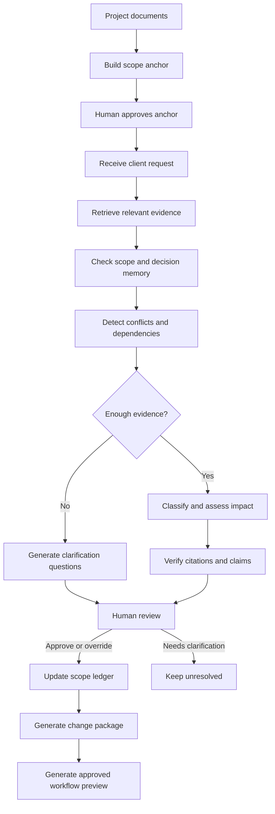

# SpecTrace - Hackathon Master Plan

> **Status:** Project concept confirmed and scope locked  
> **Hackathon:** micro1 Agentic Workflows Hackathon 2026  
> **Deadline:** August 31, 2026, 11:00 PM Pakistan time  
> **Primary goal:** Produce a correct, reproducible, testable agentic workflow with a fair baseline, measurable improvement, clear evidence, and a polished five-minute demonstration.

---

## 1. Locked Project Decision

- [x] Project selected: **SpecTrace - Requirements and Scope Intelligence Agent**
- [x] Primary user selected: **A Business Analyst or Project Manager in a small software agency managing fixed-scope client projects**
- [x] Core pain point selected: **Project scope and decisions are fragmented across documents and incoming client requests, causing contradictions, unsupported assumptions, and cumulative scope creep**
- [x] Scope Creep Ledger merged into the main BA concept
- [x] Workflow-generation feature included as an approved-output feature
- [x] Real client calls, client recordings, names, credentials, and company data excluded
- [x] Synthetic project documents and messages selected for evaluation
- [x] Human BA/PM remains the final decision-maker
- [x] No automatic client communication, legal conclusion, pricing, or contract enforcement

### One-sentence product description

> SpecTrace is a stateful, evidence-grounded agent that establishes the approved project scope, evaluates incoming client requests against it, detects contradictions and cumulative scope drift, and produces a human-approved change-impact package and workflow draft.

### Memorable product hook

> Individually reasonable requests can be collectively unreasonable.

### Primary agent-engineering insight

> Scope creep is often a memory failure before it becomes a negotiation failure.

---

## 2. Real User and Bottleneck

### Who has the problem?

A BA or PM working in a small software agency where project knowledge is spread across:

- Discovery notes
- Proposals and Statements of Work (SOWs)
- Approved requirements
- Technical constraints
- Emails and client messages
- Earlier decisions
- Change requests
- Acceptance criteria

### What happens today?

1. The BA manually reads and compares project documents.
2. Requirements are copied into spreadsheets or documents.
3. New requests arrive through email, Slack, WhatsApp, or meetings.
4. Someone searches the original scope manually.
5. Each request is judged separately.
6. Decisions are not always recorded consistently.
7. Several small requests collectively create a new workflow, role, integration, or module.
8. The agency discovers the full impact only after delivery delays or unpaid work.

### Why does solving it matter?

- Prevents unsupported assumptions from reaching developers
- Makes scope discussions evidence-based instead of argumentative
- Detects contradictory requirements earlier
- Preserves approved decisions over time
- Exposes cumulative scope drift
- Helps BAs ask better clarification questions
- Reduces avoidable rework and delivery risk
- Produces a visual workflow draft from confirmed requirements

---

## 3. Scope Fence

### Must-have features

- [ ] **Scope Anchor:** Convert project documents into approved requirements, exclusions, constraints, assumptions, unresolved questions, and superseded decisions with citations.
- [ ] **Stateful Scope-Drift Ledger:** Evaluate incoming requests against the original scope and approved decision history.
- [ ] **Evidence Verification:** Every classification must cite relevant evidence and avoid unsupported claims.
- [ ] **Contradiction and Supersession Detection:** Identify when sources conflict or an older decision has been replaced.
- [ ] **Cumulative Drift Detection:** Detect when multiple small changes collectively describe a new module, role, integration, or workflow.
- [ ] **Human Approval:** BA can approve, override, defer, or request clarification before memory is updated.
- [ ] **Change-Impact Package:** Generate affected requirements, dependencies, clarification questions, and acceptance criteria.
- [ ] **Workflow Preview:** Generate a Mermaid workflow only from approved requirements and decisions.
- [ ] **Evaluation:** Run baseline and advanced agent on the same fixed synthetic cases.
- [ ] **Reproducibility:** Provide exact commands, expected outputs, model configuration, runtime, and approximate cost.

### Should-have features

- [ ] Before-versus-after workflow comparison
- [ ] Highlight added or affected workflow nodes
- [ ] Markdown/JSON export of the scope ledger
- [ ] Downloadable Mermaid source
- [ ] Baseline-versus-agent comparison inside the UI
- [ ] Timeline/filter view for project requests

### Stretch goals

- [ ] Direct Lucidchart creation through its API
- [ ] Draw.io or BPMN export for Lucidchart import
- [ ] Swimlane workflow for User/Admin/System
- [ ] Requirement-impact graph
- [ ] Multiple project support

### Explicitly excluded

- [x] Real client or internship data
- [x] Call/audio/video or body-language analysis
- [x] Live WhatsApp, Slack, Jira, or email integrations
- [x] Automatic messages to clients
- [x] Automatic approval or rejection of scope changes
- [x] Legal interpretation of a contract
- [x] Exact price or effort estimation without verified data
- [x] Full requirements-management platform
- [x] Mobile application
- [x] Complex multi-agent orchestration added only for appearance

---

## 4. Baseline and Advanced Solution

### Real-world manual baseline context

The current process is a BA manually comparing documents, maintaining a spreadsheet, reviewing each new request, and recording decisions.

### Reproducible evaluation baseline

> A single direct LLM prompt receives the SOW/project documents and complete request thread and classifies each request.

The baseline has:

- No persistent project memory
- No vector retrieval
- No structured scope ledger
- No contradiction/supersession tool
- No citation verifier
- No cumulative-drift analysis
- No human-approval state

Expected baseline output:

```json
{
  "request_id": "CR-001",
  "classification": "IN_SCOPE | AMBIGUOUS | OUT_OF_SCOPE",
  "reason": "Short explanation"
}
```

### Advanced solution

The advanced agent receives the same evidence and cases, but it:

1. Builds a structured scope anchor.
2. Retrieves the most relevant evidence for each request.
3. Consults approved decision memory.
4. Detects contradictions and superseded decisions.
5. Classifies the request using structured output.
6. Checks whether clarification is required.
7. Validates citations and unsupported claims.
8. Assesses affected requirements and dependencies.
9. Detects cumulative drift across earlier requests.
10. Pauses for human approval.
11. Updates persistent memory only after approval.
12. Generates the change package and workflow impact.

### Fairness rule

- [ ] Baseline and advanced agent receive the same case evidence.
- [ ] Both are evaluated using the same ground-truth labels.
- [ ] Any difference in tools, memory, context, model calls, cost, or runtime is disclosed.
- [ ] Complete results, including failures, are retained.

---

## 5. Confirmed Agent Workflow



### Agent decisions

The agent may decide to:

- Retrieve more evidence
- Mark a request in scope
- Mark it out of scope
- Mark it ambiguous
- Identify a potential scope change
- Identify a contradiction
- Ask a clarification question
- Escalate for human review
- Refuse to finalize because evidence is insufficient

### Human decisions

The BA/PM may:

- Approve the agent recommendation
- Override the classification
- Supply clarification
- Defer the request
- Mark a decision as superseded
- Reject an unsupported workflow node
- Approve the final change package/workflow

---

## 6. Proposed Technology Stack

### Core

- [ ] Python 3.11
- [ ] Streamlit interactive interface
- [ ] PyMuPDF for PDF extraction
- [ ] Pydantic for structured outputs and validation
- [ ] SQLite for project memory and decision history
- [ ] Pandas for evaluation results
- [ ] Pytest for automated tests

### RAG

- [ ] Local sentence-transformer embeddings
- [ ] ChromaDB or FAISS vector store
- [ ] Metadata stored with document, page/section, evidence ID, and decision status
- [ ] Retrieval returns evidence snippets plus source references

### LLM

- [ ] Select one affordable API model
- [ ] Keep provider/model configurable through environment variables
- [ ] Store no API key in the repository
- [ ] Provide `.env.example`
- [ ] Record model name, temperature, runtime, and approximate cost
- [ ] Provide cached/sample outputs only if clearly disclosed

### Agent orchestration

- [ ] Begin with a transparent Python state machine
- [ ] Use LangGraph only if it improves control, retries, checkpoints, or trace readability
- [ ] Avoid multi-agent design unless evaluation proves it improves results

### Workflow generation

- [ ] Generate Mermaid markup from approved structured requirements
- [ ] Render Mermaid inside the application
- [ ] Validate that every diagram node links to approved evidence
- [ ] Add Lucidchart API/export only after the core submission works

---

## 7. Proposed Data Model

### Requirement

```json
{
  "requirement_id": "REQ-001",
  "title": "Guest checkout",
  "description": "Customers may checkout without creating an account.",
  "status": "APPROVED",
  "source_document": "proposal.pdf",
  "source_location": "Section 4.2",
  "evidence_id": "EVID-004",
  "dependencies": ["email confirmation"],
  "supersedes": null
}
```

### Client request

```json
{
  "request_id": "CR-001",
  "message": "Can returning customers save multiple addresses?",
  "received_at": "2026-08-01",
  "source": "synthetic_email",
  "status": "PENDING_REVIEW"
}
```

### Agent assessment

```json
{
  "request_id": "CR-001",
  "classification": "POTENTIAL_SCOPE_CHANGE",
  "confidence": 0.84,
  "related_requirements": ["REQ-001"],
  "citations": ["EVID-004"],
  "contradictions": [],
  "affected_components": ["customer identity", "address storage"],
  "clarification_required": true,
  "unsupported_claims": []
}
```

### Human decision

```json
{
  "request_id": "CR-001",
  "decision": "NEEDS_CLARIFICATION",
  "reviewer_note": "Confirm whether accounts are now required.",
  "approved_at": null
}
```

---

## 8. Synthetic Evaluation Dataset

### Dataset rules

- [ ] Use only synthetic companies, clients, messages, documents, and requirements.
- [ ] Do not reuse names, links, credentials, text, screenshots, or recordings from the internship.
- [ ] Create fixed ground-truth labels before running the agent.
- [ ] Include at least 10 cases; target 12 project cases and 25-30 requests.
- [ ] Include at least one difficult multi-failure case.
- [ ] Use the same data for baseline and advanced evaluation.

### Normal cases

- [ ] Clearly in-scope request
- [ ] Clearly excluded request
- [ ] Paraphrase of an approved requirement
- [ ] Duplicate request already approved
- [ ] Request already rejected earlier

### Ambiguity cases

- [ ] Missing user role
- [ ] Unmeasurable performance request such as "make it faster"
- [ ] Vague reporting request
- [ ] Partially covered request
- [ ] "Minor UI change" that changes the workflow

### Contradiction cases

- [ ] Guest checkout versus mandatory login
- [ ] Newer email supersedes proposal
- [ ] Request reopens a rejected integration
- [ ] Discovery notes conflict with proposal
- [ ] Two approved decisions conflict

### Dependency cases

- [ ] Export introduces permissions and audit requirements
- [ ] Saved addresses require persistent identity
- [ ] Notifications require an external service
- [ ] Admin capability affects authorization
- [ ] Removing login conflicts with saved history

### Cumulative-drift cases

- [ ] Small reporting requests collectively create a reporting module
- [ ] Role changes collectively create a permission system
- [ ] Delivery-only app gradually expands into pickup support
- [ ] Several new fields require a new database entity
- [ ] Multiple reasonable additions collectively exceed the MVP boundary

### Difficult challenge case

- [ ] Contains conflicting documents
- [ ] Contains one superseded decision
- [ ] Contains one duplicate request
- [ ] Contains one hidden dependency
- [ ] Contains one real scope change
- [ ] Contains one ambiguous request requiring clarification

---

## 9. Evaluation Design

### Primary metric

## Evidence-Grounded Scope Accuracy

A response is correct only if:

1. The classification is correct.
2. The cited evidence supports the classification.
3. No unsupported requirement is invented.
4. Clarification is requested when evidence is genuinely insufficient.

### Secondary metrics

- [ ] Macro F1 across classification labels
- [ ] Citation validity rate
- [ ] Contradiction detection recall
- [ ] Unsupported-claim rate
- [ ] Clarification precision
- [ ] Cumulative-drift detection rate
- [ ] Acceptance-criteria coverage
- [ ] Workflow-step coverage
- [ ] Unsupported workflow-node rate
- [ ] Average runtime per request
- [ ] Approximate cost per request
- [ ] Human review time on selected cases

### Evaluation outputs

- [ ] Machine-readable raw results (`results.json` or CSV)
- [ ] Baseline summary
- [ ] Advanced-agent summary
- [ ] Case-by-case comparison
- [ ] Error analysis
- [ ] Challenging-case analysis
- [ ] Runtime and cost report
- [ ] Chart/table for README and video

---

## 10. Improvement Changelog Plan

> Record actual results. Do not claim an improvement until the same evaluation proves it.

- [ ] **Baseline:** Direct LLM prompt
- [ ] **Iteration 1:** Structured Pydantic/JSON output
- [ ] **Iteration 2:** RAG with source citations
- [ ] **Iteration 3:** Persistent decision memory and ledger
- [ ] **Iteration 4:** Contradiction and supersession checks
- [ ] **Iteration 5:** Cumulative scope-drift detection
- [ ] **Iteration 6:** Verification and human approval
- [ ] **Final:** Combine only improvements that produced useful evidence

### Experiment that may be removed

- [ ] Test a small multi-agent debate or second-pass reviewer only if time permits.
- [ ] Remove it if it increases cost/latency without improving evidence-grounded accuracy.
- [ ] Document why it was removed and what it taught us.

### Changelog entry template

```text
Stage:
What we tried:
Why we tried it:
Evaluation result:
Observed failure:
Decision - kept, revised, or removed:
What we learned:
```

---

## 11. Workflow Generator Plan

### Input restriction

- [ ] Use only approved requirements and human-confirmed decisions.
- [ ] Never convert unresolved assumptions into normal workflow nodes.
- [ ] Display unresolved items as clarification-required annotations.

### Workflow elements

- [ ] Actors
- [ ] Start/end points
- [ ] Process steps
- [ ] Decision branches
- [ ] Alternate paths
- [ ] Error paths
- [ ] Admin/system actions
- [ ] Requirement-to-node evidence links

### Demonstration scenario

- [ ] Show original approved workflow.
- [ ] Add one seemingly small client request.
- [ ] Show the affected requirements and dependencies.
- [ ] Obtain human approval.
- [ ] Generate the updated workflow.
- [ ] Highlight added/changed nodes.
- [ ] Download Mermaid or export package.

### Lucidchart path

- [ ] Guaranteed: in-app Mermaid preview
- [ ] Preferred fallback: downloadable Mermaid/Draw.io/BPMN artifact
- [ ] Stretch: create a Lucidchart diagram through the API
- [ ] Never make Lucidchart access necessary for judging/reproduction

---

## 12. Repository Structure

```text
spectrace/
|-- app.py
|-- README.md
|-- AGENTS.md
|-- requirements.txt
|-- .env.example
|-- .gitignore
|-- src/
|   |-- agents/
|   |-- tools/
|   |-- rag/
|   |-- memory/
|   |-- workflows/
|   |-- schemas/
|   `-- evaluation/
|-- prompts/
|   |-- baseline.md
|   |-- scope_anchor.md
|   |-- request_analysis.md
|   |-- verification.md
|   `-- workflow_generation.md
|-- data/
|   |-- synthetic_projects/
|   `-- ground_truth/
|-- tests/
|-- results/
|   |-- baseline/
|   |-- advanced/
|   `-- comparisons/
|-- docs/
|   |-- architecture.md
|   |-- improvement_changelog.md
|   |-- reproduction.md
|   |-- agent_use.md
|   |-- limitations.md
|   `-- video_script.md
`-- evidence/
    |-- trajectories/
    |-- test_results/
    |-- screenshots/
    `-- comparisons/
```

This is a target structure, not permission to create every empty folder immediately. Add folders only when needed.

---

## 13. Execution Roadmap

## Phase 0 - Lock and Prepare

- [x] Read complete hackathon PDF
- [x] Choose problem and user
- [x] Confirm baseline and advanced concept
- [x] Confirm scope fence
- [x] Confirm evaluation approach
- [x] Confirm workflow/Lucidchart strategy
- [ ] Stop broad idea exploration
- [ ] Create project folder/repository
- [ ] Open folder in VS Code
- [ ] Start Codex Chat 1: Requirements, Benchmark, and Baseline
- [ ] Add `AGENTS.md` with project rules and verification requirements

## Phase 1 - Benchmark Before Agent

- [ ] Create one synthetic project pack
- [ ] Define its approved scope
- [ ] Create 8-10 sequential client requests
- [ ] Label every expected classification and citation
- [ ] Include one cumulative-drift pattern
- [ ] Validate the ground truth manually
- [ ] Expand to at least 10 cases after the pipeline works

## Phase 2 - Reproducible Baseline

- [ ] Write baseline prompt
- [ ] Implement baseline runner
- [ ] Save structured outputs
- [ ] Implement initial scoring script
- [ ] Run baseline on the first cases
- [ ] Preserve failures and raw results
- [ ] Commit/tag baseline

## Phase 3 - Application Skeleton

- [ ] Build basic Streamlit interface
- [ ] Add project-document upload
- [ ] Add client-request input
- [ ] Display placeholder assessment
- [ ] Add approve/override/clarify/defer controls
- [ ] Keep the interface functional throughout development

## Phase 4 - Scope Anchor and RAG

- [ ] Extract PDF/text content
- [ ] Chunk with source metadata
- [ ] Build embeddings/index
- [ ] Extract structured scope anchor
- [ ] Display citations
- [ ] Add human approval for the anchor
- [ ] Test retrieval quality

## Phase 5 - Stateful Agent and Ledger

- [ ] Implement agent state
- [ ] Implement request classifier
- [ ] Implement decision memory
- [ ] Implement contradiction check
- [ ] Implement supersession check
- [ ] Implement cumulative-drift summary
- [ ] Persist approved decisions
- [ ] Add retries only where justified

## Phase 6 - Verification and Human Review

- [ ] Validate citation existence
- [ ] Check whether evidence supports the conclusion
- [ ] Detect unsupported claims
- [ ] Require clarification when evidence is insufficient
- [ ] Implement human override
- [ ] Record agent recommendation and final human decision separately

## Phase 7 - Change Package and Workflow

- [ ] Generate affected requirements/dependencies
- [ ] Generate clarification questions
- [ ] Generate acceptance criteria
- [ ] Generate Mermaid workflow from approved scope
- [ ] Render workflow in the application
- [ ] Verify workflow nodes against evidence
- [ ] Add before/after workflow view if time permits

## Phase 8 - Full Evaluation

- [ ] Freeze evaluation cases before final comparison
- [ ] Run baseline on all cases
- [ ] Run advanced agent on all cases
- [ ] Calculate primary and secondary metrics
- [ ] Inspect every failure
- [ ] Analyse challenging case
- [ ] Record runtime and cost
- [ ] Update improvement changelog after every meaningful iteration

## Phase 9 - Reproduction and Quality

- [ ] Test from a clean virtual environment
- [ ] Verify exact installation command
- [ ] Verify exact baseline command
- [ ] Verify exact advanced-agent command
- [ ] Verify exact evaluation command
- [ ] Confirm expected outputs
- [ ] Remove secrets and private data
- [ ] Check licenses and versions
- [ ] Run all tests
- [ ] Review repository as a judge

## Phase 10 - Submission

- [ ] Finalize README
- [ ] Finalize improvement changelog
- [ ] Finalize reproduction guide
- [ ] Finalize agent-use disclosure
- [ ] Export representative Codex development trajectories
- [ ] Export representative solution-agent trajectories
- [ ] Prepare screenshots/results
- [ ] Write five-minute video script
- [ ] Record realistic end-to-end execution
- [ ] Show baseline-versus-final comparison
- [ ] Mention strongest improvement
- [ ] Mention one removed experiment
- [ ] State main limitation and hot take
- [ ] Create submission ZIP
- [ ] Confirm video access requires no permission request
- [ ] Submit before internal deadline

---

## 14. Time Plan

### August 29 - Foundation and Baseline

- [ ] Lock concept and create repository
- [ ] Create first synthetic project and ground truth
- [ ] Implement baseline and scoring skeleton
- [ ] Build basic Streamlit UI
- [ ] Start document extraction and structured scope anchor

### August 30 - Advanced Agent

- [ ] Finish RAG retrieval
- [ ] Finish stateful request ledger
- [ ] Add contradiction/supersession/cumulative-drift checks
- [ ] Add human approval
- [ ] Generate change package and workflow preview
- [ ] Expand and freeze evaluation dataset
- [ ] Run iterative evaluation

### August 31 - Prove, Polish, and Submit

- [ ] Freeze features early
- [ ] Run final baseline and advanced comparison
- [ ] Test clean reproduction
- [ ] Complete README/changelog/reproduction guide
- [ ] Organize trajectories and evidence
- [ ] Record and upload video
- [ ] Package and submit by **8:00 PM Pakistan time**
- [ ] Keep **8:00-11:00 PM** as upload/emergency buffer

---

## 15. Rubric Checklist - 100 Points

## Problem and User Value - 15

- [x] Clearly defined BA/PM user
- [x] Real recurring bottleneck
- [x] Practical value explained
- [ ] Add concise user story to README
- [ ] Include a realistic synthetic demonstration

## Agent Solution and Engineering - 30

- [ ] RAG retrieves relevant evidence
- [ ] Agent uses persistent decision memory
- [ ] Agent calls controlled tools
- [ ] Agent detects insufficient evidence
- [ ] Agent verifies citations and claims
- [ ] Agent maintains state across requests
- [ ] Agent pauses for human approval
- [ ] Design choices linked to evaluation failures

## End-to-End Quality - 20

- [ ] Project setup works
- [ ] Scope anchor is reviewable
- [ ] Incoming request is analysed
- [ ] Human can approve/override
- [ ] Ledger updates correctly
- [ ] Change package is usable
- [ ] Workflow preview is polished
- [ ] Output does not read like an unchecked AI draft

## Measured Improvement - 15

- [ ] Fair baseline implemented
- [ ] Same cases used for baseline and final
- [ ] Primary metric defined before final run
- [ ] Complete results submitted
- [ ] Changelog connects changes to evidence
- [ ] Failed/removed experiment documented

## Reproducibility - 15

- [ ] Synthetic data included
- [ ] Ground truth included
- [ ] Exact commands included
- [ ] Versions recorded
- [ ] Runtime and cost documented
- [ ] `.env.example` included
- [ ] Clean-environment reproduction completed

## Hot Take and Insights - 5

- [ ] Main failure mode identified from evidence
- [ ] Final hot take connected to observed results
- [ ] Explain how the insight changes future agent design

---

## 16. Submission Deliverables Checklist

### Complete solution code and changelog

- [ ] Full source code
- [ ] Prompts/instructions shaping the agent
- [ ] Synthetic data
- [ ] Tests
- [ ] Baseline runner
- [ ] Advanced runner
- [ ] Evaluation runner
- [ ] Improvement changelog
- [ ] Main failure mode
- [ ] Hot take

### Reproduction guide

- [ ] Clean setup instructions
- [ ] Environment variables
- [ ] Exact baseline command
- [ ] Exact solution command
- [ ] Exact evaluation command
- [ ] Required data explanation
- [ ] Expected output
- [ ] Versions
- [ ] Runtime
- [ ] Approximate cost

### Five-minute solution video

- [ ] Problem and user
- [ ] Existing/manual process
- [ ] Simple baseline
- [ ] One complete realistic execution
- [ ] Human approval checkpoint
- [ ] Scope-drift ledger
- [ ] Workflow before/after
- [ ] Final comparison
- [ ] Most valuable improvement
- [ ] Removed experiment
- [ ] Main limitation/hot take

### Agent trajectories

- [ ] Representative Codex development trajectory
- [ ] Representative SpecTrace execution trajectory
- [ ] Agent instructions visible
- [ ] Tool calls and responses visible
- [ ] Retry/failure visible
- [ ] Human feedback/checkpoint visible
- [ ] No credentials/private data

---

## 17. Privacy, Safety, and Integrity Checklist

- [ ] Use no real customer names
- [ ] Use no real project names
- [ ] Use no real meeting links or passwords
- [ ] Use no private call transcripts or recordings
- [ ] Use no internship spreadsheets or screenshots in submission
- [ ] Do not claim legal contract interpretation
- [ ] Do not send client messages automatically
- [ ] Do not auto-approve scope changes
- [ ] Clearly label synthetic data
- [ ] Clearly disclose every AI/coding agent used
- [ ] Clearly disclose what existed before the hackathon
- [ ] Keep secrets in local environment variables only

---

## 18. Decision Log

| Date | Decision | Reason |
|---|---|---|
| Aug 28 | Use Codex as primary coding agent | Direct repository editing, commands, tests, and trajectories |
| Aug 28 | Choose BA/requirements direction | Real problem observed during internship |
| Aug 29 | Merge Scope Creep Ledger into SpecTrace | Adds persistent memory, cumulative failure mode, and measurable value |
| Aug 29 | Exclude call-quality rating | Requires private recordings, tone/body-language context, and sensitive judgments |
| Aug 29 | Use synthetic data only | Privacy, ownership, reproducibility, and competition rules |
| Aug 29 | Keep BA/PM as final reviewer | Consequential scope decisions require human judgment |
| Aug 29 | Guarantee Mermaid preview; Lucidchart is stretch | Preserves reproducibility and prevents integration risk |

Add every meaningful scope or architecture decision here as the project evolves.

---

## 19. Definition of Done

SpecTrace is ready to submit only when:

- [ ] A judge can install it from a clean environment.
- [ ] A judge can run the baseline with one documented command.
- [ ] A judge can run the advanced agent with one documented command.
- [ ] A judge can run the evaluation with one documented command.
- [ ] The advanced agent processes a project end-to-end.
- [ ] Every classification is supported by evidence or marked uncertain.
- [ ] Human approval is required before updating scope memory.
- [ ] Cumulative scope drift is visible.
- [ ] The workflow preview uses approved requirements only.
- [ ] Baseline and advanced results are honestly compared.
- [ ] Failures and limitations are documented.
- [ ] The README, changelog, reproduction guide, video, and trajectories are complete.
- [ ] The ZIP contains no credentials or private information.
- [ ] Submission is uploaded before the deadline.

---

## 20. Immediate Next Actions

- [ ] Create the `spectrace` project folder.
- [ ] Open it in VS Code.
- [ ] Create/init the Git repository after confirming no starter repository is required.
- [ ] Start **Codex Chat 1 - Requirements, Benchmark, and Baseline**.
- [ ] Paste the locked project brief and instruct Codex not to implement until it has inspected the workspace and proposed the smallest baseline.
- [ ] Create one synthetic SOW and sequential request thread.
- [ ] Create ground-truth labels before running any model.
- [ ] Implement the baseline first.
- [ ] Commit the baseline before starting the advanced agent.

---

> **Execution rule:** From this point onward, new ideas go into a post-hackathon backlog unless they directly improve a rubric metric and can be completed without risking the baseline, evaluation, documentation, or submission.
